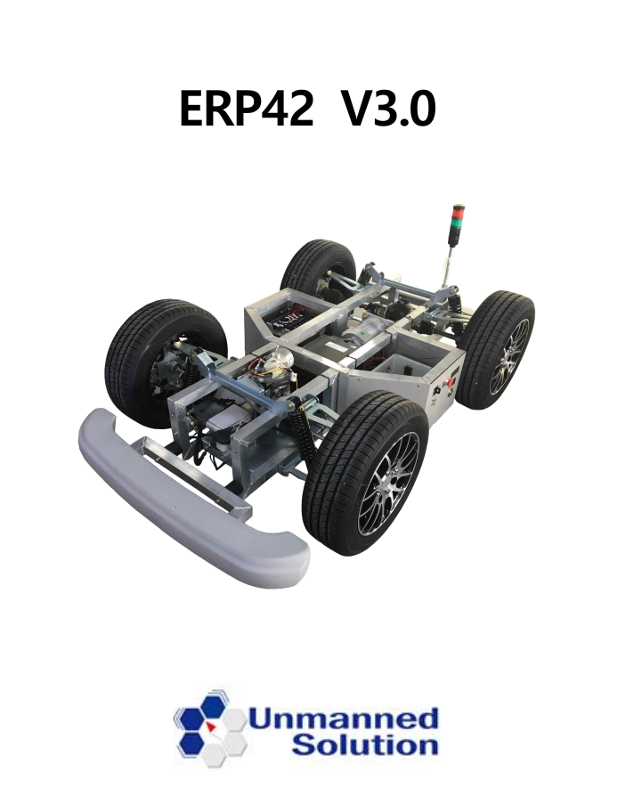

# ROS1 ERP42 Serial Interface & Joystick Control

## 프로젝트 소개

ERP42 자율주행 플랫폼과 ROS1을 이용하여 차량 제어 및 Serial 통신을 수행한 프로젝트입니다.

Joystick 입력을 ERP42 제어 명령으로 변환하고, RS232(UART) 기반 Serial Protocol을 통해 차량과 양방향 통신을 구현하였습니다.

또한 ERP42에서 송신하는 차량 상태 데이터를 수신하여 ROS Topic으로 Publish하도록 구현하였으며, ROS Publisher/Subscriber 구조와 ERP42 Serial Protocol을 분석하며 통신 과정을 이해하였습니다.

---

## 실험 플랫폼

<p align="center">

</p>

---

## 시스템 구성

<p align="center">

</p>

---

# 주요 기능

## 1. Joystick 차량 제어

- ROS `sensor_msgs/Joy` 메시지 Subscribe
- 버튼 및 아날로그 스틱 입력을 ERP42 제어 명령으로 변환
- 차량 기어, 속도, 조향 및 브레이크 제어
- ERP_CMD Topic Publish

### Joystick Mapping

| Input | Function |
|--------|----------|
| LB | Forward Gear |
| RB | Reverse Gear |
| Left Stick (Y) | Speed / Brake |
| Right Stick (X) | Steering |

---

## 2. ERP42 Serial 통신

ERP42 Serial Protocol 기반 UART 통신 구현

### 송신

- ERP42 Packet 생성
- Big Endian Packet 구성 (`struct.pack`)
- Alive Counter 관리
- UART 송신

### 수신

- UART 데이터 수신
- Little Endian Packet Parsing (`struct.unpack`)
- ERP_STATUS 메시지 생성
- ROS Topic Publish

---

## 3. 차량 상태 모니터링

ERP42에서 수신한 차량 상태 정보를 ROS Topic으로 Publish

- Auto / Manual 상태
- Gear
- Speed
- Steering
- Brake
- Encoder

또한 Raw Packet을 별도 Topic으로 Publish하여 디버깅이 가능하도록 구성하였습니다.

---

# 구현 내용

## ROS

### Publisher

- ERP_CMD
- ERP_STATUS
- ERP42 Raw Packet

### Subscriber

- sensor_msgs/Joy
- ERP_CMD

---

## UART Communication

- RS232 Serial 통신
- Packet 생성 및 Parsing
- STX / ETX 확인
- Alive Counter 관리
- Serial 연결 확인

---

## Packet 처리

### 송신

```text
Control Command

↓

Packet 생성

↓

struct.pack()

↓

UART 전송
```

### 수신

```text
UART Packet

↓

struct.unpack()

↓

Packet Parsing

↓

ERP_STATUS 생성

↓

ROS Publish
```

---

## 데이터 변환

Joystick 입력을 ERP42 프로토콜 형식으로 선형 변환하여 차량 제어 명령으로 사용하였습니다.

| 항목 | 입력 | 출력 |
|------|------|------|
| Speed | 0 ~ 1 | 0 ~ 5 |
| Brake | -1 ~ 0 | 0 ~ 100 |
| Steering | -1 ~ 1 | ±2000 |

실차 테스트를 통해 Steering 방향을 보정하여 차량의 실제 조향 방향과 일치하도록 매핑하였습니다.

---

# 프로젝트에서 수행한 역할

- ERP42 Serial 통신 코드 분석
- ERP42 Serial Protocol 분석
- ROS Publisher / Subscriber 구조 이해
- UART Packet Parsing 과정 분석
- Joystick 제어 노드 구현
- 차량 제어 명령 생성
- Joystick 입력과 ERP42 제어 명령 매핑
- 차량 상태 ROS Topic Publish
- 실차 테스트를 통한 Steering 방향 보정
- 프로젝트 코드 분석 및 문서화

---

# 사용 기술

- Python
- ROS1 (rospy)
- UART (RS232)
- PySerial
- ROS Publisher / Subscriber
- Binary Packet Parsing
- struct.pack / struct.unpack
- Big Endian / Little Endian

---

# 프로젝트를 통해 배운 점

- ROS Publisher / Subscriber 기반 노드 간 통신 구조
- UART 기반 차량 제어 프로토콜 구현
- Binary Packet 처리 방법
- Big Endian / Little Endian 데이터 처리
- ERP42 Serial Protocol 이해
- ROS 메시지를 이용한 차량 제어 및 상태 모니터링
- Joystick 입력을 실제 차량 제어 명령으로 변환하는 과정
- 실차 테스트를 통한 제어 값 보정 방법

---

# 참고

본 프로젝트는 ERP42 V3.0 Serial Communication Protocol을 참고하여 구현하였습니다.

제조사에서 제공한 매뉴얼 및 통신 문서는 저장소에 포함하지 않았습니다.
